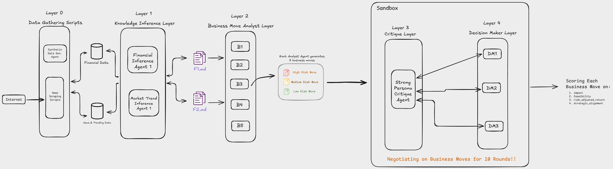

# Big4

> **13 AI agents. 4 layers. 10 rounds of adversarial debate. One strategic recommendation.**

[](https://youtu.be/vVV2Z2FfIO4)

---

Strategy consulting is a **$500B+ industry**, yet the core process hasn't changed — a team of analysts reads reports, debates internally, and presents recommendations. We asked: what if we could replicate that entire workflow with adversarial multi-agent AI? Not a single chatbot giving generic advice, but a layered architecture of autonomous agents that replicates the hierarchy and separation of tasks in firms like the Big 4.

The architecture is inspired by how neural networks work in layers — **each layer refines the signal** from the previous one. We applied that same principle to strategic reasoning.

Give Big4 a company ticker. It fetches financial and market data, generates strategic moves through 5 independent analyst personas, then stress-tests every move through 10 rounds of adversarial negotiation between a veteran Critic and a 3-member Decision Board. Every move is scored, ranked, and fully auditable. This isn't a ChatGPT wrapper — it's a full consulting pipeline.

---

## Architecture

<p align="center">
  
</p>

| Layer                                             | What Happens                                                                                                                                                                                          | Agents                               | Parallelism |
| ------------------------------------------------- | ----------------------------------------------------------------------------------------------------------------------------------------------------------------------------------------------------- | ------------------------------------ | ----------- |
| **Layer 0** — Data Gathering               | Synthesizes financial fundamentals + market/news sentiment for the target company                                                                                                                     | 1 synthesizer (2 parallel LLM calls) | ✅          |
| **Layer 1** — Inference                    | Derives structured insights: one agent on financials, one on market trends → produces F1.md + F2.md                                                                                                  | 2 inference agents                   | ✅          |
| **Layer 2** — Analyst Moves                | 5 analyst personas independently propose low/medium/high-risk strategic moves grounded in F1 + F2                                                                                                     | 5 analyst agents → up to 15 moves   | ✅          |
| **Sandbox** (L3 + L4) — Adversarial Debate | A veteran Critic debates 3 high-agency Decision Makers (Growth Strategist, Operational Pragmatist, Stakeholder Value Advocate) across 10 rounds per move. All 5 sandbox negotiations run in parallel. | 1 Critic + 3 Decision Makers         | ✅          |
| **Output** — Scoring & Ranking             | Based on all debates, each Decision Maker scores every move on Impact, Feasibility, Risk-Adjusted Return, and Strategic Alignment (out of 120). Top 3 recommended.                                    | —                                   | —          |

---

## Key Features

- **Adversarial negotiation that actually works** — the Critic raises genuine concerns, Decision Makers defend substantively, and scores reflect the quality of the debate. Weak moves get low scores. Strong moves survive scrutiny.
- **Full auditability** — conversation logs, scoring justifications, and intermediate documents are all persisted. You can trace exactly why a move scored 87/120 vs. 64/120.
- **Real-time pipeline visualization** — watch 4 layers light up sequentially, zoom into live negotiations, and see spider charts appear on completion
- **Parallel sandbox execution** — all 5 move negotiations run concurrently, cutting total pipeline time dramatically
- **Persona engineering over prompt engineering** — every agent has a deeply crafted persona (not just a system prompt). The difference between a generic "analyze this" and a Critic who has "seen three companies fail from overconfident strategy" is night and day in debate quality.

---

## Tech Stack

| Component           | Technology                              |
| ------------------- | --------------------------------------- |
| Agent Orchestration | LangGraph (StateGraph, Send, subgraphs) |
| LLM                 | Anthropic Claude (Haiku) via Python SDK |
| Backend             | FastAPI + Python                        |
| Frontend            | Next.js 16 + TypeScript                 |

---

## Getting Started

### Backend

```bash
cd backend
pip install -r requirements.txt
cp .env.example .env
# Add your ANTHROPIC_API_KEY to .env
python main.py
```

The API server starts at `http://localhost:8000`.

### Frontend

```bash
cd frontend
npm install
npm run dev
```

The UI starts at `http://localhost:3000`.

##### Run the Pipeline

Open `http://localhost:3000`, enter a ticker (e.g. `AAPL`, `TSLA`), and hit **Analyze**. Watch the 4-layer pipeline execute in real time.

---

## How Scoring Works

After 10 rounds of debate, each of the 3 Decision Makers scores the move on 4 metrics (each out of 10):

| Metric                         | What It Measures                                         |
| ------------------------------ | -------------------------------------------------------- |
| **Impact**               | Effect on growth, revenue, or market position            |
| **Feasibility**          | Realistic to execute given resources and constraints     |
| **Risk-Adjusted Return** | Upside relative to downside exposure                     |
| **Strategic Alignment**  | Fit with long-term direction and competitive positioning |

- Per agent: **40 points** (4 × 10)
- Per move: **120 points** (3 agents × 40)
- Top 3 moves by total score → **Recommended**

---

## What's Next

- **Live data integration** — replace synthetic data with agent web tools for SEC filings, real-time Yahoo Finance updates, and trending topics in the space
- **Multi-ticker portfolio mode** — analyze multiple companies and generate cross-portfolio strategy recommendations
- **Export to PDF/Slides** — presentation-ready output with charts, scores, and key reasoning

---

## License

MIT
